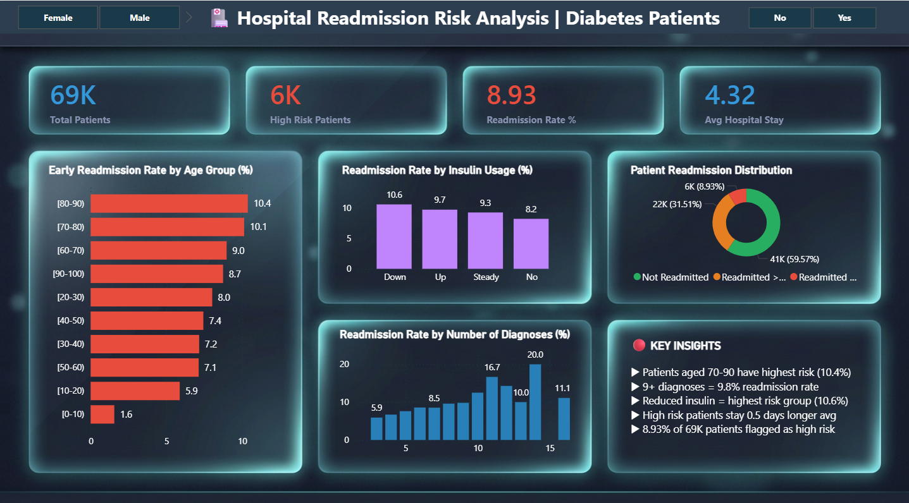
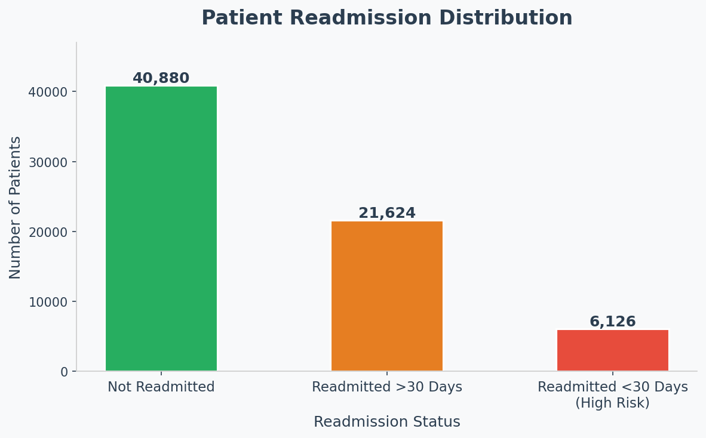
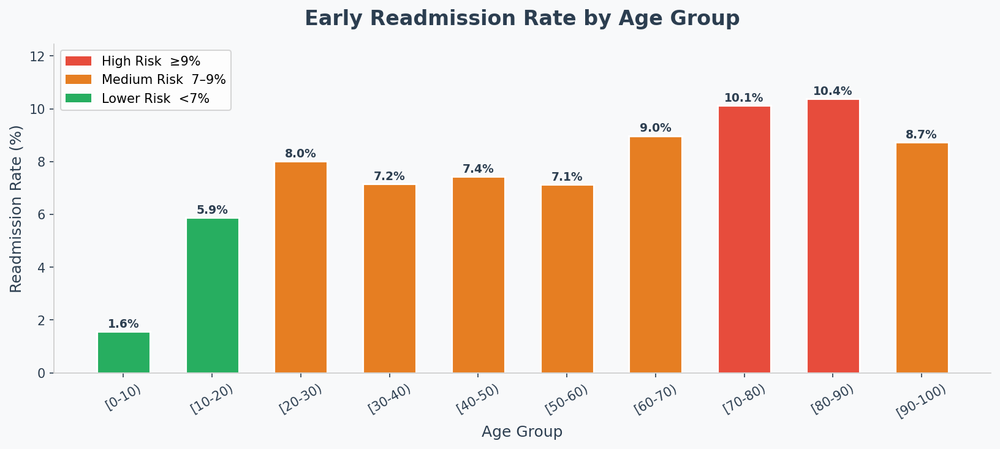
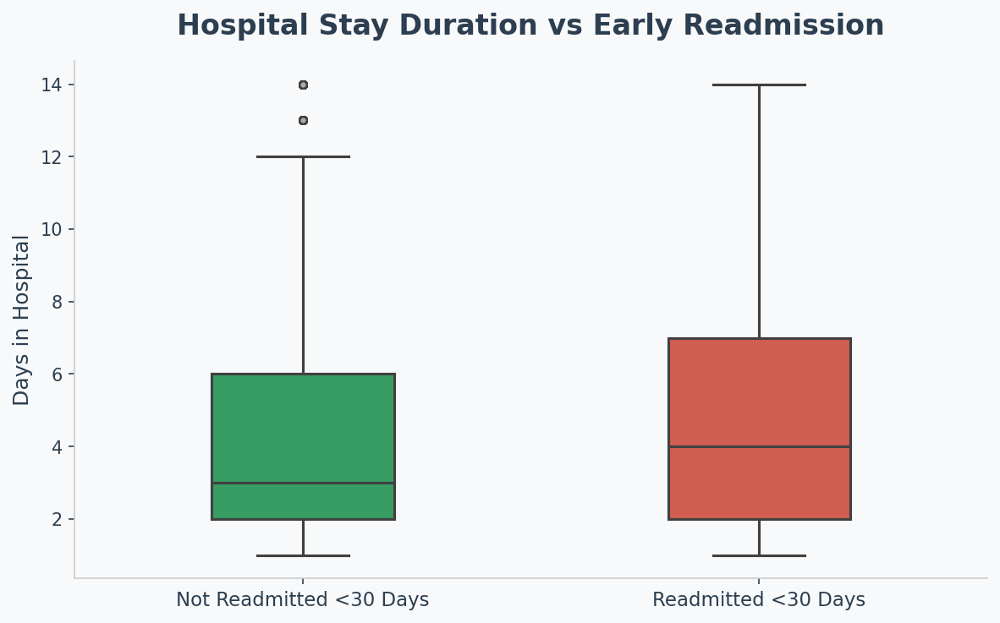
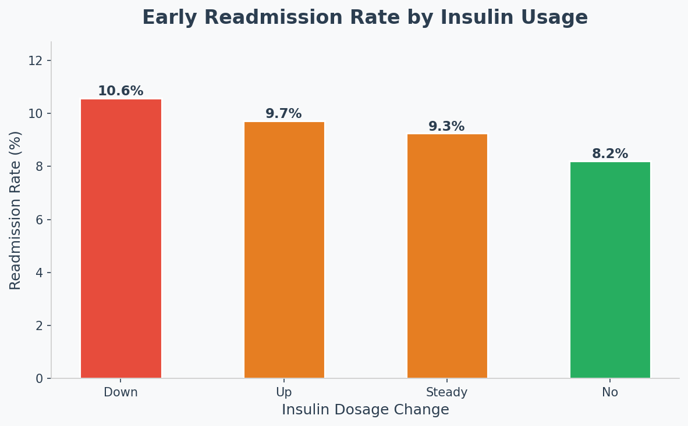
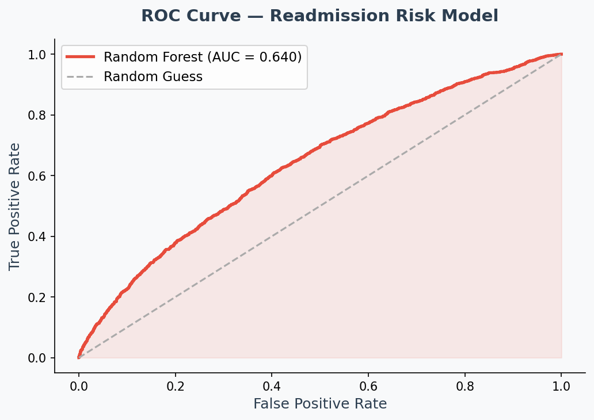
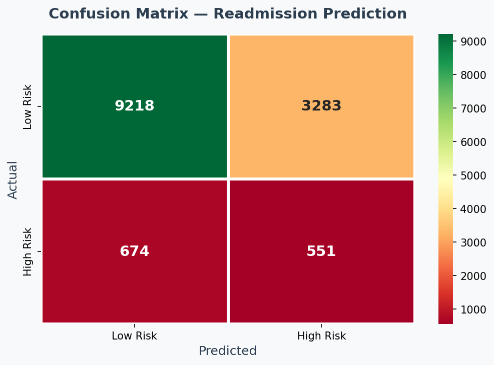
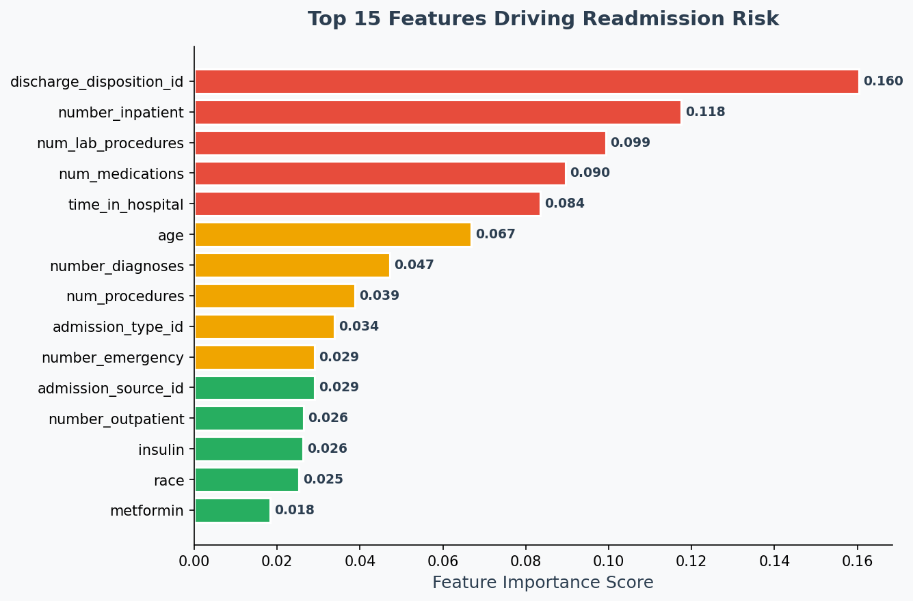

# 🏥 Hospital Readmission Risk Analysis — Diabetes Patients



## 📌 Project Overview

Early hospital readmission (within 30 days) is one of the most costly challenges in healthcare. For diabetic patients, unplanned readmissions indicate gaps in treatment quality and post-discharge care. This project analyzes **68,630 real patient records** from 130 US hospitals to identify key risk factors driving early readmission and build a predictive model to flag high-risk patients before discharge.

**Business Question:** *Which diabetic patients are most likely to be readmitted within 30 days, and what factors drive that risk?*

---

## 🎯 Project Objectives

- Identify patient demographics and clinical factors associated with early readmission
- Perform SQL-based cohort analysis to uncover business-level insights
- Build a machine learning model to predict high-risk patients
- Design an interactive Power BI dashboard for hospital decision-makers

---

## 📊 Dataset

| Property | Detail |
|----------|--------|
| Source | UCI ML Repository — Diabetes 130-US Hospitals |
| Time Period | 1999 – 2008 |
| Original Records | 101,766 patient encounters |
| After Cleaning | 68,630 unique patients |
| Features | 50 clinical and demographic variables |
| Target Variable | Readmitted within 30 days (Yes/No) |

**Dataset Link:** [UCI ML Repository](https://archive.ics.uci.edu/ml/datasets/Diabetes+130-US+hospitals+for+years+1999-2008)

---

## 🛠️ Tools & Technologies

| Category | Tools |
|----------|-------|
| Language | Python 3 |
| Data Analysis | Pandas, NumPy |
| Visualization | Matplotlib, Seaborn |
| Database | SQL, SQLite |
| Machine Learning | Scikit-learn (Random Forest) |
| Dashboard | Power BI Desktop |
| Environment | VS Code |

---

## 📁 Project Structure

```
healthcare-readmission-analysis/
│
├── 01_first_look.py              # Initial data exploration
├── 02_data_cleaning.py           # Data cleaning & preprocessing
├── 03_eda.py                     # Exploratory data analysis
├── 04_eda_professional.py        # Professional EDA charts
├── 05_sql_analysis.py            # SQL business queries
├── 06_model.py                   # ML model training & evaluation
├── 07_export_for_powerbi.py      # Power BI data export
│
├── charts/                       # All generated visualizations
│   ├── 01_readmission_distribution.png
│   ├── 02_readmission_by_age.png
│   ├── 03_time_in_hospital.png
│   ├── 04_medications.png
│   ├── 05_insulin_usage.png
│   ├── 06_confusion_matrix.png
│   ├── 07_roc_curve.png
│   └── 08_feature_importance.png
│
├── dashboard_preview.png         # Power BI dashboard screenshot
└── README.md
```

---

## 🔄 Project Workflow

```
Raw Data (101,766 records)
        ↓
Data Cleaning & Preprocessing
(removed duplicates, handled missing values)
        ↓
Exploratory Data Analysis
(5 professional charts)
        ↓
SQL Business Analysis
(6 business queries on SQLite)
        ↓
Machine Learning Model
(Random Forest — AUC: 0.64)
        ↓
Power BI Dashboard
(Interactive, filterable)
```

---

## 🧹 Data Cleaning

- Replaced `?` placeholders with proper null values
- Dropped 5 columns with >40% missing values (weight, payer_code, etc.)
- Removed duplicate patient records — kept only first encounter per patient
- Created binary target variable: `1` = readmitted within 30 days, `0` = otherwise
- Final dataset: **68,630 unique patient records**

---

## 📈 Exploratory Data Analysis

### Key Charts

**1. Readmission Distribution**



- 59.57% of patients were not readmitted
- 8.93% (6,126 patients) were readmitted within 30 days — the high risk group

---

**2. Early Readmission Rate by Age Group**



- Patients aged **70-90 have the highest readmission rate (10.4%)**
- Younger patients (<30) show significantly lower risk (1.6–5.9%)

---

**3. Hospital Stay Duration vs Readmission**



- High risk patients stay an average of **0.5 days longer** in hospital
- Longer stays indicate more complex conditions and higher readmission risk

---

**4. Insulin Usage vs Readmission**



- Patients with **reduced insulin dosage (Down)** have the highest readmission rate (10.6%)
- Patients with no insulin have the lowest rate (8.2%)

---

## 🗄️ SQL Analysis

All analysis performed on a SQLite database with 68,630 patient records.

### Key Queries & Findings

**Query 1 — Overall Readmission Summary**
```sql
SELECT 
    readmitted,
    COUNT(*) as total_patients,
    ROUND(COUNT(*) * 100.0 / SUM(COUNT(*)) OVER(), 2) as percentage
FROM patients
GROUP BY readmitted
ORDER BY total_patients DESC
```
→ 8.93% of patients readmitted within 30 days

**Query 2 — Top 5 High Risk Age Groups**
```sql
SELECT age, COUNT(*) as total_patients,
    ROUND(SUM(readmitted_binary) * 100.0 / COUNT(*), 2) as readmission_rate_pct
FROM patients
GROUP BY age
HAVING total_patients > 100
ORDER BY readmission_rate_pct DESC
LIMIT 5
```
→ Ages 80-90 have highest rate at 10.38%

**Query 5 — High Risk vs Low Risk Patient Profile**

| Patient Group | Avg Days in Hospital | Avg Medications | Avg Lab Procedures |
|---------------|---------------------|-----------------|-------------------|
| Low Risk | 4.27 | 15.72 | 42.95 |
| High Risk | 4.81 | 16.69 | 44.91 |

→ High risk patients consistently show higher complexity across all clinical metrics

---

## 🤖 Machine Learning Model

### Model: Random Forest Classifier

| Parameter | Value |
|-----------|-------|
| Estimators | 100 |
| Max Depth | 10 |
| Class Weight | Balanced |
| Train/Test Split | 80/20 |

### Performance

| Metric | Score |
|--------|-------|
| Accuracy | 71% |
| ROC-AUC Score | 0.64 |
| High Risk Recall | 45% |

**ROC Curve**



**Confusion Matrix**



### Top 5 Features Driving Readmission Risk



1. **Discharge Disposition** (0.160) — how patient was discharged
2. **Number of Inpatient Visits** (0.118) — prior hospital history
3. **Lab Procedures Count** (0.099) — clinical complexity
4. **Number of Medications** (0.090) — treatment complexity
5. **Time in Hospital** (0.084) — length of stay

### Model Limitations & Notes
- AUC of 0.64 is consistent with published benchmarks on this dataset
- Class imbalance (only 9% high risk) addressed using `class_weight='balanced'`
- Further improvement possible with SMOTE oversampling or threshold tuning

---

## 📊 Power BI Dashboard

Interactive dashboard built for hospital decision-makers with:
- **4 KPI Cards** — Total Patients, High Risk Count, Readmission Rate, Avg Stay
- **4 Interactive Charts** — Age risk, Insulin impact, Distribution, Diagnoses
- **Key Insights Panel** — Top 5 actionable findings
- **2 Slicers** — Filter by Gender and Risk Level


---

## 💡 Business Recommendations

Based on the analysis, the following actions are recommended for the hospital:

1. **Target elderly patients (70-90)** for enhanced post-discharge follow-up programs — they represent the highest readmission risk group at 10.4%

2. **Monitor insulin management closely** — patients with reduced insulin dosage have the highest readmission rate. Review medication protocols for this group

3. **Flag patients with 9+ diagnoses** — complex cases with multiple diagnoses show nearly 10% readmission rate and need dedicated care coordinators

4. **Prioritize patients with prior inpatient visits** — number of previous inpatient visits is the second strongest predictor of readmission

5. **Implement 30-day follow-up calls** for all patients staying 5+ days — longer hospital stays strongly correlate with readmission risk

---

## 🚀 How to Run This Project

```bash
# 1. Clone the repository
git clone https://github.com/YOUR_USERNAME/healthcare-readmission-analysis.git

# 2. Install required libraries
pip install pandas numpy matplotlib seaborn scikit-learn

# 3. Download dataset from Kaggle
# https://www.kaggle.com/datasets/brandao/diabetes
# Place diabetic_data.csv in the project folder

# 4. Run scripts in order
python 01_first_look.py
python 02_data_cleaning.py
python 04_eda_professional.py
python 05_sql_analysis.py
python 06_model.py
python 07_export_for_powerbi.py

# 5. Open healthcare_powerbi.csv in Power BI Desktop
```

---

## 📚 References

- Strack, B., et al. (2014). Impact of HbA1c Measurement on Hospital Readmission Rates. BioMed Research International
- UCI Machine Learning Repository — Diabetes 130-US Hospitals Dataset
- Centers for Medicare & Medicaid Services — Hospital Readmissions Reduction Program

---

## 👩‍💻 Author

**Sandhya Bharti**
B.E. Computer Science — Chandigarh University

[](www.linkedin.com/in/sandhyabharti7)
[](https://github.com/sandhyabharti14)

---

*This project was built as part of a Data Analyst portfolio targeting healthcare analytics domain.*
